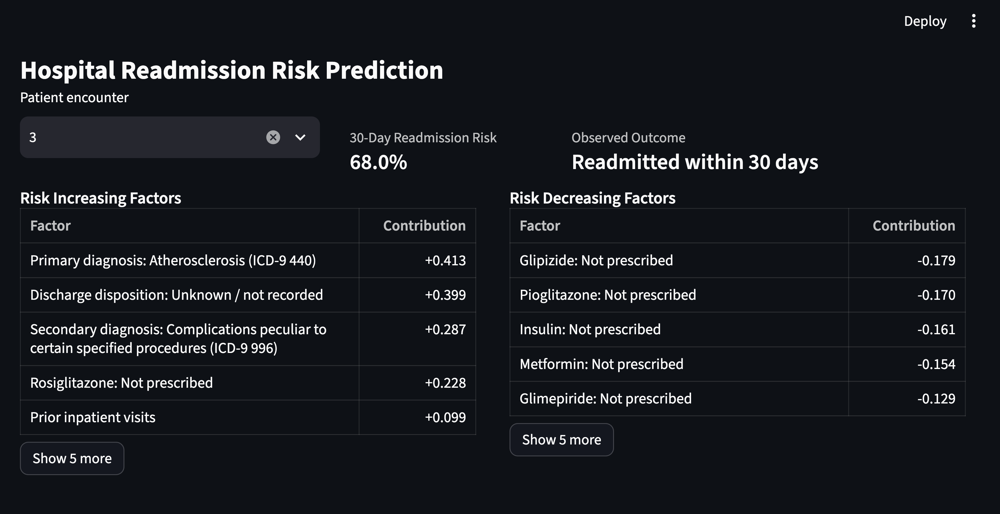

# Hospital Readmission Risk Prediction

## Overview

Hospital readmissions are an important clinical and operational problem. Preventable readmissions can indicate gaps in discharge planning or follow-up care and can affect hospital reimbursement and publicly reported performance. Identifying patients at elevated risk before discharge can help clinicians prioritize follow-up, care coordination, and other resources.

This project predicts whether a diabetic patient will be readmitted within 30 days of discharge using the UCI Diabetes 130-US Hospitals dataset. Logistic Regression and Random Forest classification models are trained and evaluated using approximately 100,000 historical hospital encounters.

The project extends beyond binary classification into a clinician-facing decision-support prototype. The application presents a patient's estimated 30-day readmission probability together with patient-specific factors that increase or decrease the model's prediction.

The application intentionally does not convert model associations into treatment recommendations. Its purpose is to expose the evidence underlying a prediction while leaving interpretation and intervention decisions to the clinician.

---

## Application Preview



---

# Project Objectives

* Preprocess a large healthcare dataset
* Prepare categorical and numerical healthcare data for machine learning
* Train and evaluate Logistic Regression and Random Forest classifiers
* Compare baseline and tuned model performance
* Perform hyperparameter tuning and cross-validation
* Persist trained models and preprocessing artifacts for reuse
* Separate expensive model training from patient-specific inference
* Calculate patient-specific model contributions
* Translate encoded model features into clinician-readable terminology
* Present both risk-increasing and risk-decreasing factors
* Build a usable clinician-facing interface for exploring predictions
* Validate core prediction, translation, and data-integrity behavior with automated tests

---

# Dataset

Dataset: Diabetes 130-US Hospitals for Years 1999–2008

Source:

https://archive.ics.uci.edu/dataset/296/diabetes+130-us+hospitals+for+years+1999-2008

Dataset characteristics:

* Approximately 100,000 hospital encounters
* Data collected from multiple hospitals in the United States
* Includes demographic, diagnosis, medication, utilization, and encounter information
* Population consists specifically of patients with diabetes
* Binary classification target: readmitted within 30 days or not

The current Streamlit prototype uses held-out test encounters as simulated patients. These records allow the complete prediction and explanation workflow to be demonstrated without representing the held-out records as new clinical data.

---

# Models Used

## Logistic Regression

Logistic Regression was selected as the primary clinician-facing model because of its interpretability.

For an individual patient, each feature value can be combined with its learned coefficient to calculate that feature's contribution to the model's prediction. This makes it possible to show which patient-specific factors most strongly increase or decrease predicted readmission risk.

The application therefore uses Logistic Regression for patient-facing inference and explanation.

## Random Forest Classifier

Random Forest was selected because it can capture nonlinear relationships, thresholds, and interactions between features that Logistic Regression may not represent well.

Random Forest remains useful as a comparison model during model development. Because its predictions are more difficult to reduce into concise patient-specific explanations, it is retained as an internal comparison model rather than used for clinician-facing output.

---

# Data Preprocessing

The preprocessing pipeline performs the following operations:

* Removes sparse or unnecessary columns
* Replaces missing-value placeholders with a consistent categorical value
* Converts the target variable into binary format
* Preserves coded categorical variables as categorical data before encoding
* Performs one-hot encoding on categorical variables
* Standardizes numerical features using `StandardScaler`
* Preserves the fitted scaler and feature-column schema for later inference

Coded fields such as admission type, discharge disposition, and admission source represent categories rather than continuous quantities. Treating these IDs as numerical values would incorrectly imply mathematical relationships between category numbers. They are therefore encoded categorically.

Similarly, one-hot encoded features remain binary rather than being standardized. Scaling is applied to numerical features where magnitude is meaningful.

Removed columns:

* `encounter_id`
* `patient_nbr`
* `weight`
* `payer_code`
* `medical_specialty`
* `max_glu_serum`
* `A1Cresult`

---

# Model Evaluation

The project evaluates trained models using:

* Precision
* Recall
* F1 Score
* 5-fold cross-validation F1 scores
* Mean cross-validation F1 score

The dataset is highly imbalanced, meaning substantially fewer patients were readmitted within 30 days than were not readmitted. F1 score is therefore used as the primary model-selection metric because it incorporates both recall and precision.

These metrics are intended for model development and validation rather than clinician-facing output. They are stored with the trained model for engineering reference.

---

# Cross-Validation

Five-fold cross-validation is performed on the baseline models to evaluate performance across different training and validation splits.

Individual F1 scores and mean F1 score are stored as model metadata rather than displayed to the clinical user.

---

# Hyperparameter Tuning

`GridSearchCV` tests multiple hyperparameter combinations using cross-validation. Parameter combinations are compared using F1 score, and the best-performing estimator is retained.

## Logistic Regression Parameters

* `max_iter`
* `C`
* `class_weight`

## Random Forest Parameters

* `n_estimators`
* `max_depth`
* `class_weight`

Hyperparameter tuning improved F1 performance compared with the initial baseline models by reducing the models' tendency to favor the majority non-readmission class.

---

# Model Persistence

Training and inference are separated so the complete dataset does not need to be preprocessed and the models retrained whenever a patient prediction is requested.

After training, the application stores a model artifact containing:

* Tuned Logistic Regression model
* Tuned Random Forest model
* Fitted preprocessing information
* Feature-column schema
* Precision, recall, and F1 metrics
* Selected model hyperparameters
* Cross-validation results

The artifact is serialized using `joblib` and stored at:

```text
artifacts/readmission_model_bundle.joblib
```

Normal use loads this artifact directly rather than repeating preprocessing, cross-validation, and hyperparameter tuning. Retraining replaces the currently stored model artifact.

Held-out test encounters are also persisted separately so the prototype interface can demonstrate predictions against records that were not used to train the model.

---

# Patient-Specific Explainability

The clinician-facing application does not stop at a binary prediction.

For a selected held-out patient encounter, the application:

1. Loads the persisted Logistic Regression model
2. Calculates the patient's estimated probability of 30-day readmission
3. Calculates the contribution of each patient-specific feature to the Logistic Regression prediction
4. Separates positive and negative contributions
5. Ranks risk-increasing and risk-decreasing factors by magnitude
6. Translates encoded model features into clinician-readable terminology
7. Displays the most influential factors alongside their relative contributions

The application initially displays five factors in each direction. The clinician can independently expand either list in increments of five when additional context is useful.

This approach avoids presenting hundreds or thousands of encoded features at once while allowing the clinician to inspect additional contributors rather than relying on an arbitrary fixed cutoff.

---

# Clinician-Readable Feature Translation

The machine-learning feature space contains representations that are useful computationally but difficult to interpret directly, including:

* ICD-9 diagnosis codes
* Admission type IDs
* Admission source IDs
* Discharge disposition IDs
* One-hot encoded medication states
* Other encoded categorical variables

A translation layer converts these features into readable descriptions before they are displayed.

Examples include:

```text
diag_1_584
→ Primary diagnosis: Acute renal failure (ICD-9 584)

insulin_Up
→ Insulin: Dose increased

metformin_Steady
→ Metformin: Dose unchanged

glipizide_No
→ Glipizide: Not prescribed
```

UCI-specific category mappings and ICD-9 diagnosis references are handled separately. When the dataset provides only a broad three-digit ICD-9 diagnosis category, the application uses the corresponding category description rather than falsely presenting a more specific diagnosis.

Missing categories explicitly represented as `NULL` in the source mapping are displayed as `Unknown / not recorded` rather than being silently discarded.

---

# Risk-Increasing and Risk-Decreasing Factors

The interface presents two complementary sets of model contributors.

**Risk Increasing Factors** are patient-specific features with positive contributions to the Logistic Regression prediction.

**Risk Decreasing Factors** are patient-specific features with negative contributions to the prediction.

Both are shown because understanding why the model predicts lower risk can be useful alongside understanding why it predicts higher risk.

These contributions describe the behavior of the statistical model. They should not be interpreted as causal effects or treatment recommendations.

For example, if `Rosiglitazone: Not prescribed` appears as a risk-increasing factor, this does **not** imply that prescribing rosiglitazone would reduce that patient's readmission risk. Likewise, if the absence of another medication appears as a risk-decreasing factor, it does not imply that avoiding that medication is protective.

Medication status may instead reflect underlying disease severity, treatment requirements, comorbidities, or other characteristics of the patient population.

---

# Design Decision: Preserve Clinical Context

An earlier design direction considered filtering model contributors to show only factors classified as "actionable."

This approach was rejected for two reasons.

First, actionability is context-dependent and difficult to define reliably in software. A factor that appears non-actionable in isolation may still provide important context for a clinician.

Second, removing non-actionable contributors can distort the apparent explanation. If a major portion of a patient's prediction is associated with age, diagnosis, prior utilization, or another factor that cannot simply be changed, hiding that factor would make the remaining contributors appear disproportionately important.

The application therefore ranks contributors by their actual model contribution rather than filtering them according to a predefined definition of actionability.

Clinical judgment remains necessary to determine which factors are relevant and which interventions, if any, are appropriate.

---

# Limitations and Clinical Interpretation

This project is a decision-support prototype, not a clinical treatment recommendation system.

## Association Does Not Imply Intervention

Model contributors represent statistical associations learned from historical data. A feature increasing or decreasing predicted risk does not establish that changing that feature will change the patient's outcome.

The interface deliberately exposes model contributors rather than converting them into automated treatment recommendations.

## Prior Utilization Does Not Explain Cause

Features such as previous inpatient or emergency visits may be highly useful for identifying patients at elevated risk.

However, knowing that a patient has frequent prior utilization does not explain why those encounters occurred or what intervention will prevent another admission. Additional clinical assessment remains necessary.

## Dataset Population

The UCI Diabetes 130-US Hospitals dataset specifically represents hospital encounters involving patients with diabetes. Results should not be assumed to generalize to all hospital populations.

## Limited Protective and Lifestyle Information

The available dataset strongly influences what the model can identify as risk-increasing or risk-decreasing.

Many potentially useful preventive or lifestyle variables are unavailable, including:

* Exercise and physical activity
* Sleep duration and quality
* Smoking behavior
* Alcohol use
* Dietary patterns
* Other longitudinal health behaviors

As a result, risk-decreasing contributors may frequently consist of medication-status variables or other encounter characteristics rather than the broader protective health behaviors a clinician might ideally want to evaluate.

This limitation illustrates an important property of clinical machine learning: model explainability cannot recover information that was never captured in the underlying data. A more clinically comprehensive decision-support system would require richer longitudinal patient information.

---

# Streamlit Interface

The project includes a Streamlit interface for clinician-facing inference.

The interface allows the user to:

* Select a held-out patient encounter
* View the raw predicted 30-day readmission probability
* View the observed outcome for validation against the held-out record
* Review the five strongest risk-increasing factors
* Review the five strongest risk-decreasing factors
* Independently expand either contributor list in increments of five

The interface intentionally presents the probability itself rather than assigning an arbitrary label such as "high risk" or "low risk."

The observed outcome is displayed because the current application uses historical held-out encounters. In a prospective clinical deployment, the future readmission outcome would not yet be known and therefore would not be displayed.

---

# Current Program Flow

## Clinician Interface

Run:

```bash
python3.12 -m streamlit run app.py
```

The Streamlit application loads the persisted model and held-out encounters and provides patient-specific prediction and explanation without retraining the models.

## Model Development and Retraining

Running `main.py` provides the model-development workflow:

```text
Readmission Prediction Tool

1. Use saved model
2. Retrain model
3. Quit
```

Selecting retraining performs:

1. Dataset preprocessing
2. Baseline model training
3. Cross-validation
4. Hyperparameter tuning
5. Tuned-model evaluation
6. Model and metadata persistence

This separation keeps computationally expensive training operations out of the normal clinician-facing inference workflow.

---

# Testing

The project includes an automated `pytest` test suite covering the primary prediction, data-integrity, and feature-translation workflows.

The current suite contains 34 tests covering:

* Model and held-out dataset artifact availability
* Compatibility between model features and held-out encounter data
* Binary target integrity
* Prediction output and probability bounds
* Consistency between predicted class and predicted probability
* Patient-specific Logistic Regression contribution calculations
* Correct separation and ordering of risk-increasing and risk-decreasing factors
* ICD-9 diagnosis translation and fallback behavior
* Admission type, admission source, and discharge disposition translation
* Missing-value translation
* Numerical feature labels
* Clinician-readable medication status labels
* Protection against applying medication-specific terminology to unrelated categorical features

The full automated test suite currently passes:

```text
34 passed
```

Run the tests from the project root with:

```bash
python3.12 -m pytest -v
```

Visual layout and clinical readability are evaluated manually because characteristics such as text wrapping, spacing, and interpretability are not meaningfully validated by the current automated tests.

---

# Future Improvements

The current project is intentionally scoped as a static clinical decision-support prototype rather than a production clinical system.

Potential future work could include:

* Usability testing with clinicians
* Evaluation of model performance and behavior across clinically relevant patient subgroups
* Investigation of unexpected or potentially misleading feature contributions
* Independent validation using another compatible healthcare dataset, if an appropriate dataset becomes available

The current scope intentionally does not include EMR integration, synthetic patient generation, real-time monitoring, or production clinical deployment. Held-out encounters provide realistic examples for demonstrating patient-specific inference without fabricating clinical records.

The available dataset also limits which protective and lifestyle factors can be modeled. Adding variables such as exercise, sleep, diet, smoking, or alcohol use would require an appropriate dataset containing those measurements rather than artificially adding them to the existing data.

---

# Project Structure

```text
ReadmissionPredictionTool/
│
├── artifacts/
│   └── readmission_model_bundle.joblib
│
├── data/
│   ├── raw/
│   │   └── diabetic_data.csv
│   │
│   ├── reference/
│   │   ├── IDS_mapping.csv
│   │   ├── V26 I-9 Diagnosis.txt
│   │   └── Dtab09.txt
│   │
│   └── test/
│       └── held_out_encounters.joblib
│
├── tests/
│   ├── test_data_integrity.py
│   ├── test_feature_labels.py
│   └── test_prediction.py
│
├── app.py
├── feature_labels.py
├── preprocessing.py
├── model_training.py
├── main.py
├── README.md
└── .gitignore
```

---

# Requirements

Python 3

Required libraries include:

* pandas
* scikit-learn
* joblib
* Streamlit
* pytest

Install dependencies:

```bash
pip install pandas scikit-learn joblib streamlit pytest
```

---

# Running the Project

For the clinician-facing application:

```bash
python3.12 -m streamlit run app.py
```

For model training, evaluation, and terminal-based testing:

```bash
python3 main.py
```

Run the automated tests with:

```bash
python3.12 -m pytest -v
```

---

# Author

Ryan Dailey